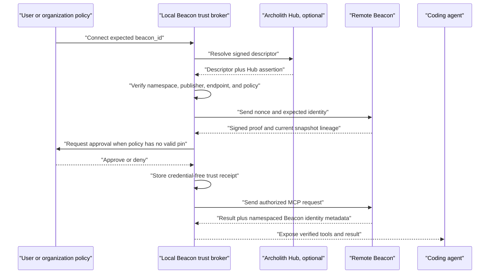

# Beacon Trust, Hub, and Federation Product Plan

**Status:** APPROVED PRODUCT DIRECTION — PHASED IMPLEMENTATION REQUIRED
**Date:** 2026-08-09
**Owner:** Beacon / Archolith
**Parent roadmap:** `docs/beacon-functional-product-roadmap.md`
**Planning horizon:** v0.3 through v1.0

## 1. Approved product shape

Archolith provides the default Beacon directory, trust service, and optional hosting platform.
Beacon remains an open, self-hostable protocol and product that can operate locally, privately, or
without an Archolith account.

Centralization is a usability and trust option, not a protocol dependency.

```text
local repository
  -> local Beacon over stdio

external consumer
  -> local Beacon trust broker
  -> Archolith Hub discovery and trust assertion, when configured
  -> hosted or self-hosted remote Beacon
  -> verified five-tool read surface
```

The Hub may host the Beacon data plane or only introduce a consumer to a project-owned endpoint.
The project publisher remains the authority for project knowledge.

## 2. Product principles

1. **Open protocol:** self-hosted and direct-URL operation remain supported and testable.
2. **Default central experience:** Archolith offers the easiest discovery, identity, hosting, and
   account path.
3. **Local enforcement:** a local trust broker decides whether a remote Beacon is exposed to an
   agent as trusted.
4. **No silent trust:** discovery, TLS, authentication, cryptographic verification, and local trust
   approval are separate states.
5. **Publisher authority:** the project publisher signs or otherwise attests project content and
   identity; the Hub cannot silently become the author of self-hosted project knowledge.
6. **Explicit custody:** Archolith-hosted private projects disclose that Archolith processes their
   decrypted Beacon knowledge. Self-hosted private mode preserves project data custody.
7. **Read/write separation:** reading a Beacon never grants question submission, refresh,
   publication, moderation, or administration.
8. **Fail closed:** identity, signature, lineage, authorization, and isolation failures expose no
   trusted project tools or content.
9. **Trusted identity is not trusted prose:** signed content can still be mistaken, stale, or
   adversarial. Remote commands never execute automatically.
10. **MCP compatibility:** trust metadata and negotiation use versioned Beacon descriptors,
    extensions, and namespaced metadata without changing the existing five answer payloads.

## 3. Actors and components

| Actor/component | Responsibility | Must not become |
| --- | --- | --- |
| Project publisher | Reviews knowledge, controls project identity, approves publication | An implicit Archolith employee/admin role |
| External consumer | Chooses a Beacon and local trust policy | Automatically trusted because they know a URL |
| Coding agent | Reads verified Beacon answers through an MCP client | A trust authority or autonomous command executor |
| Local trust broker | Resolves, verifies, authorizes, pins, proxies, and audits remote access | A transparent pass-through for unverified content |
| Archolith Hub control plane | Directory, identity, ownership verification, keys, policy, OAuth integration, audit | Mandatory runtime dependency for direct/self-hosted mode |
| Archolith hosted data plane | Serves opted-in public/private snapshots and MCP traffic | Undisclosed custodian of private plaintext |
| Self-hosted data plane | Serves project-owned public/private Beacon traffic | Automatically trusted merely because it is registered |
| Identity provider | Authenticates users and issues resource-bound access | Source of truth for project content |

## 4. Supported deployment and access modes

| Mode | Discovery | Data custody | Authentication | Hub required at query time |
| --- | --- | --- | --- | --- |
| Local only | Filesystem | Project owner | Local process boundary | No |
| Archolith-hosted public | Hub directory | Archolith | Anonymous read, bounded/rate-limited | Yes |
| Archolith-hosted private | Hub directory with access controls | Archolith | OAuth membership/scopes | Yes |
| Self-hosted public | Hub listing or direct descriptor URL | Project owner | Anonymous or project policy | No after direct resolution |
| Self-hosted private | Private Hub listing or direct descriptor URL | Project owner | Project OAuth/resource server | No after direct resolution |
| Unlisted private | Direct descriptor URL only | Project owner | Project OAuth/resource server | No |

All six modes use the same Beacon identity, snapshot, answer, and conformance contracts. Hosting
location must not alter the meaning of project knowledge.

## 5. Portable identity and discovery descriptor

### Stable Beacon identity

Each remotely addressable project has a stable, globally namespaced `beacon_id`, for example:

```text
io.github.archolith/beacon
```

The identifier is distinct from:

- repository URL, which may move;
- endpoint URL, which may migrate;
- publisher account, which may rotate;
- snapshot digest, which changes with content; and
- package/distribution identity.

The namespace owner must prove control before the Hub registers the ID. Repository transfer and
publisher changes create auditable identity events rather than silently changing the subject.

### Descriptor

A versioned, signed descriptor is retrievable from a direct URL and optionally from the Hub:

```json
{
  "beacon_descriptor_version": "1.0",
  "beacon_id": "io.github.archolith/beacon",
  "project": {
    "name": "Beacon",
    "repository": "https://github.com/Archolith/beacon"
  },
  "publisher": {
    "id": "io.github.archolith",
    "key_id": "publisher-key-2026-01"
  },
  "mcp": {
    "transport": "streamable-http",
    "url": "https://beacon.archolith.dev/mcp"
  },
  "snapshot": {
    "url": "https://beacon.archolith.dev/snapshot.json",
    "sha256": "...",
    "sequence": 42
  },
  "access": {
    "mode": "public_read",
    "authorization_resource": "https://beacon.archolith.dev/mcp"
  },
  "signatures": []
}
```

No credentials, local paths, private repository names, or membership data appear in a public
descriptor. A private listing may reveal only the fields authorized for the requesting subject.

### Discovery order

1. Exact descriptor URL supplied and approved by the user or organization.
2. Previously pinned local trust record.
3. Repository-linked descriptor.
4. Archolith Hub lookup by `beacon_id`.
5. Optional MCP Registry entry pointing at the same descriptor/endpoint.

Archolith discovery is the default convenience path, not the only resolution path.

## 6. Local-to-remote trust preflight

MCP `2026-07-28` is stateless and removed the protocol-level initialize handshake. Beacon therefore
uses a trust preflight and a versioned Beacon extension; it does not recreate hidden transport
sessions.

### Sequence



Direct/self-hosted mode skips the Hub messages but performs every endpoint/publisher verification.

### Challenge and proof

The broker sends a cryptographically random nonce and its expected identity. The remote returns a
short-lived signed proof over canonical bytes:

```json
{
  "beacon_trust_proof_version": "1.0",
  "challenge": "...",
  "beacon_id": "io.github.archolith/beacon",
  "repository": "https://github.com/Archolith/beacon",
  "endpoint_origin": "https://beacon.archolith.dev",
  "server_key_id": "...",
  "snapshot_sha256": "...",
  "snapshot_sequence": 42,
  "previous_snapshot_sha256": "...",
  "issued_at": "...",
  "expires_at": "...",
  "signature": "..."
}
```

The exact signature envelope is selected through a security review and interoperability fixture.
Use established signing/canonicalization libraries and standards; do not implement cryptography.

The proof protects against endpoint impersonation, stale descriptor replay, and snapshot rollback.
TLS protects each request in transit. The local broker caches a proof only until its expiry and
rechecks identity metadata on every response.

### Trust receipt

The local broker stores a credential-free receipt containing:

- Beacon ID and expected repository;
- descriptor source and digest;
- publisher/server key IDs and trust anchor;
- endpoint origin;
- approved access mode and local policy;
- last verified snapshot sequence/digest;
- verification/expiry times; and
- approval source: human, organization policy, or explicitly labeled development TOFU.

Tokens, authorization codes, and private signing material never enter the receipt.

### Trust states

| State | Meaning | Agent access |
| --- | --- | --- |
| `unverified` | URL known; identity not proven | No remote project tools |
| `verified` | Descriptor, publisher, endpoint, proof, and lineage pass | Read only if policy allows |
| `authorized` | Resource-bound OAuth and scopes pass | Scope-limited access |
| `trusted` | User or organization approved the verified publisher/project | Trusted-mode read surface |
| `revoked` | Local, publisher, Hub, or authorization revocation applies | None |

Cryptographic verification does not itself grant local trust. Silent trust-on-first-use is not the
default. Development TOFU is opt-in, visibly weaker, and cannot satisfy production conformance.

### Reapproval events

Fail closed and request explicit reapproval when:

- Beacon ID or repository subject changes;
- publisher/server key changes without a valid rotation chain;
- endpoint origin changes outside approved migration policy;
- snapshot sequence moves backward or lineage breaks;
- descriptor/proof signature fails or expires;
- Hub and publisher assertions disagree; or
- authorization resource/audience changes.

A normal forward snapshot signed by an already approved publisher does not require human approval.

## 7. Authentication and authorization

Public read may be anonymous, but remains rate-limited and audited. Private and write operations use
OAuth aligned with the current MCP authorization specification.

Minimum scopes:

```text
beacon:read
beacon:questions:submit
beacon:questions:moderate
beacon:refresh
beacon:publish
beacon:admin
```

Requirements:

- tokens are issued for and audience-bound to the exact Beacon resource;
- token issuer, audience, expiry, subject, and scopes are validated on every request;
- authorization-server credentials are not reused across issuers;
- inbound MCP tokens are never passed through to GitHub, Menhir, or another backend;
- public, private, project, and tenant caches cannot cross authorization boundaries;
- endpoint routing cannot override token-authorized project identity; and
- refresh/publish/admin are never implied by read or question submission.

For private self-hosting, the project operator may use its own conforming authorization server. The
Archolith Hub can store a private pointer and ownership assertion without proxying project content.

## 8. Archolith Hub architecture

### Control plane

The Hub control plane owns:

- Beacon ID registration and namespace policy;
- repository/domain ownership verification;
- publisher and server key registration, rotation, and revocation;
- signed discovery descriptors and identity event history;
- user, organization, project membership, and OAuth policy integration;
- public directory/search and private listings;
- hosting/deployment configuration;
- question-queue policy and moderation identities;
- audit, abuse response, and revocation; and
- transparent service/version/status metadata.

The control plane does not author project claims or silently promote questions into knowledge.

### Hosted data plane

The optional Archolith data plane owns:

- immutable snapshot storage and serving;
- remote MCP execution over Streamable HTTP;
- provider refresh jobs only when explicitly configured;
- per-project resource limits and tenant isolation;
- health, readiness, freshness, coverage, and degraded-mode reporting;
- backups, rollback, and retention; and
- request/refresh audit and operational telemetry.

Public and private data planes must be isolated by policy and tested boundaries, not only UI flags.

### Self-hosted federation

A self-hosted project can:

- publish a descriptor directly without registering with Archolith;
- register a public or private Hub pointer without uploading content;
- use its own OAuth/resource server;
- rotate endpoints while retaining Beacon identity through signed migration;
- withdraw the Hub listing without invalidating direct operation; and
- pass the same conformance suite as Archolith hosting.

No proprietary Hub response may be required to interpret a conforming Beacon snapshot or answer.

### Transparency and recovery

The Hub maintains an append-oriented identity event history for registration, ownership transfer,
key rotation, endpoint migration, suspension, and revocation. Consumers can detect unexpected
changes and recover from a compromised key through a documented publisher/organization process.

Whether this uses a public transparency log, signed event feed, or another standard mechanism is an
implementation decision that requires a threat-model review.

## 9. Unanswered-question workflow

Agents and consumers may submit source-cited knowledge gaps for later project review. Submission is
a write capability separate from the five read-only Beacon tools.

Candidate lifecycle:

```text
open -> answered
open -> deferred
open -> duplicate
open -> rejected
answered -> superseded
```

Each question carries:

- stable project-scoped identity;
- submitter identity class and authorization context;
- question text and task context;
- sources already checked;
- why available Beacon answers were insufficient;
- creation/update times and lifecycle state;
- duplicate/supersession links;
- maintainer response and supporting sources; and
- promotion status into trusted project knowledge.

Rules:

- anonymous public read does not imply submission;
- public submission, if enabled, requires abuse controls and bounded quotas;
- a submitted question is untrusted input, not project knowledge;
- an answer becomes trusted knowledge only through explicit maintainer policy, citations, and a new
  signed snapshot/record;
- rejection/defer reasons remain visible according to project policy; and
- prompt injection, secrets, personal data, and spam are filtered/quarantined before agent reuse.

The first implementation may use a Hub API and UI. An optional MCP write extension comes only after
scope, audit, consent, and compatibility fixtures exist; it is not silently added as a sixth public
tool.

## 10. Consumer safety

A verified publisher can publish harmful or incorrect instructions. The local broker and clients
therefore enforce:

- remote-origin labels on every answer;
- publisher, Beacon ID, trust state, snapshot digest, freshness, and mode visibility;
- no automatic execution of setup/test/shell commands from remote content;
- no automatic write, refresh, question submission, or scope elevation;
- bounded response/document/schema sizes and parsing depth;
- timeout, redirect, SSRF, origin, and content-type controls;
- secret and credential redaction in logs;
- isolation between projects and authenticated subjects; and
- a one-action local revoke/disconnect path.

Source citations establish provenance, not truth. Confidence/status fields remain required and
independent of cryptographic identity.

## 11. Illustrative product interfaces

These interfaces are directional; exact names require CLI fixtures before implementation.

```text
beacon discover io.github.archolith/beacon
beacon trust inspect io.github.archolith/beacon
beacon trust add io.github.archolith/beacon
beacon connect io.github.archolith/beacon
beacon trust revoke io.github.archolith/beacon
```

`beacon connect` verifies policy and exposes a local stdio proxy to the verified remote Streamable
HTTP server. This gives existing local MCP clients trusted remote access without requiring every
client to implement Beacon-specific verification.

Illustrative Hub surfaces:

```text
GET  /v1/beacons/{beacon_id}
GET  /v1/beacons/{beacon_id}/snapshot
POST /v1/beacons/{beacon_id}/questions
GET  /v1/beacons/{beacon_id}/questions
POST /v1/beacons/{beacon_id}/mcp
```

Route names do not define the protocol contract. Descriptor, trust, snapshot, auth, and MCP schemas
do.

## 12. Phased implementation

### v0.3 — Portable identity and verification foundation

- define `beacon_id` and descriptor fixtures;
- load/query v0.2 snapshot 1.x locally;
- add snapshot signing/verification prototype and exact digest rules;
- add local `verify`/`trust inspect` behavior without remote tool proxying;
- preserve local/offline operation; and
- define the local unanswered-question record/lifecycle fixture.

Exit evidence: a local consumer verifies that a signed snapshot belongs to the expected Beacon ID
and repository, detects tampering, and rejects a mismatched identity.

### v0.5 — Publisher trust, lineage, and review lifecycle

- publisher/server key model and rotation/revocation fixtures;
- snapshot sequence, predecessor digest, anti-rollback checks, and trust receipts;
- signed descriptor and endpoint migration fixtures;
- question deduplication, moderation, answer, and promotion flow;
- dynamic-provider identity bound to the same Beacon ID; and
- trust metadata carried compatibly outside the five answer payloads.

Exit evidence: local policy follows a valid content/key migration, rejects rollback and unexpected
key replacement, and promotes an answered question only through a newly signed knowledge record.

### v0.8 — Archolith Hub and trusted remote access

- Archolith Hub control-plane alpha and public directory;
- optional Archolith-hosted public and private data planes;
- self-hosted public/private descriptor registration and direct mode;
- local trust broker and `connect` stdio bridge;
- stateless Beacon trust extension over current MCP plus Streamable HTTP;
- OAuth resource binding, project scopes, tenant isolation, and audit;
- centralized question submission/moderation with abuse controls;
- transparency/revocation/status surfaces; and
- threat-model, backup/rollback, load, and cross-project access drills.

Exit evidence: an external user resolves and trusts a public hosted Beacon, an authorized user
connects to a private Beacon, a self-hosted project works without Hub query-time dependency, and all
identity/isolation/revocation negative fixtures fail closed.

### v1.0 — Stable federation and conformance

- stable descriptor, trust proof/receipt, identity event, and authorization profile specifications;
- hosted/self-hosted conformance kit and compatibility fixtures;
- publisher recovery, key compromise, endpoint migration, and Hub outage runbooks;
- documented public/private custody and retention promises;
- at least one Archolith-hosted and two independent self-hosted reference Beacons; and
- versioning/deprecation policy for trust and federation extensions.

Exit evidence: a conforming non-Archolith implementation can publish a Beacon that the standard
local broker verifies and uses without proprietary interpretation.

## 13. Verification and release gates

### Identity and trust

- correct Beacon ID/repository/key/endpoint verifies;
- altered descriptor, proof, or snapshot fails;
- challenge replay and expired proof fail;
- snapshot rollback and broken lineage fail;
- valid signed key/endpoint rotation succeeds;
- unexpected rotation requires reapproval; and
- revoked local/publisher/Hub trust immediately blocks access.

### Authorization and isolation

- anonymous public read cannot write;
- question submitter cannot moderate or publish;
- project A token cannot read project B;
- tenant caches and logs do not leak cross-project content;
- incorrect OAuth issuer/audience/resource/scope fails; and
- no inbound token reaches an upstream provider.

### Hosting and federation

- hosted public/private and self-hosted public/private pass the same answer fixtures;
- direct mode works during Hub outage with valid cached policy;
- Hub delisting does not corrupt a self-hosted Beacon identity;
- hosted private custody disclosure is visible before authorization;
- backup/restore preserves identity and snapshot lineage; and
- descriptor/MCP/snapshot versions negotiate or fail with actionable diagnostics.

### Consumer safety

- remote command text is never autoexecuted;
- unverified tools never reach the agent in trusted mode;
- prompt-injection fixtures remain labeled remote data;
- oversized/recursive/redirect/SSRF fixtures are rejected; and
- trust state and provenance remain visible in cached and degraded modes.

## 14. Explicit non-goals through v1

- requiring Archolith hosting or an Archolith account for direct/self-hosted mode;
- automatic execution of remote project commands;
- treating cryptographic identity as factual correctness;
- silent cross-project search or authorization;
- end-to-end secrecy from Archolith for Archolith-hosted private data;
- billing, paid marketplace placement, or multi-region commercial SLA before core Hub use is
  validated; and
- inventing custom cryptographic primitives.

## 15. Decisions requiring fixtures and review

1. Canonical Beacon ID namespace and transfer policy.
2. Descriptor discovery locations and the Hub's production domain/API naming.
3. Signature/canonicalization standards and whether Sigstore supplements publisher keys.
4. Exact trust extension identifier, methods, namespaced metadata, and MCP compatibility window.
5. Key custody, hardware-backed options, rotation cadence, compromise recovery, and transparency
   mechanism.
6. How repository/domain ownership is proven for each supported forge.
7. Trust receipt storage, organization policy distribution, expiry, and development TOFU UX.
8. Archolith-hosted private encryption, retention, deletion, backup, region, and operator-access
   policy.
9. Public directory moderation, abuse response, delisting, appeals, and namespace disputes.
10. Question identity, deduplication, retention, privacy, moderation, and promotion policy.
11. Whether private self-hosted listings disclose project names before authentication.
12. Which Hub capabilities remain free/public infrastructure versus later commercial services.

Resolve these with executable adversarial fixtures and complete user journeys. Do not let schema
prose substitute for ownership, compromise, isolation, rollback, and recovery tests.

## 16. Standards references

- MCP 2026-07-28 stateless protocol and extensions:
  `https://blog.modelcontextprotocol.io/posts/2026-07-28/`
- MCP 2026-07-28 transport:
  `https://modelcontextprotocol.io/specification/2026-07-28/basic/transports`
- MCP 2026-07-28 authorization:
  `https://modelcontextprotocol.io/specification/2026-07-28/basic/authorization`
- MCP security guidance:
  `https://modelcontextprotocol.io/docs/tutorials/security/security_best_practices`
- MCP remote registry publishing:
  `https://modelcontextprotocol.io/registry/remote-servers`
