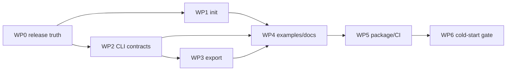

# Beacon v0.2 — Publishable Static Product Plan

**Status:** READY FOR IMPLEMENTATION
**Date:** 2026-08-09
**Owner:** Beacon
**Parent roadmap:** `docs/beacon-functional-product-roadmap.md` — v0.2
**Starting commit:** `77ad631`
**Target release:** `0.2.0`

## 1. Outcome

Ship Beacon as a dependable local product that a maintainer can install, initialize, review, export,
and connect to a coding agent without editing Python or asking the Beacon maintainer for help.

The release is complete when a maintainer unfamiliar with Beacon can go from an existing repository
to a validated, inspected, source-cited local Beacon in 15 minutes, using only the CLI and docs.

v0.2 product loop:

```text
install wheel
  -> beacon init
  -> review beacon.yaml
  -> beacon validate --strict-warnings
  -> beacon inspect --task-hint "..."
  -> beacon export
  -> connect MCP client / beacon serve
  -> commit beacon.yaml + reviewed snapshot if desired
```

## 2. Current baseline

The release starts from a working manifest-driven product, not from zero.

| Capability | Current state | v0.2 disposition |
| --- | --- | --- |
| Manifest schema/loader/validator | Shipped, `beacon_version: "0.1"` | Preserve compatibility |
| Canonical Markdown doc index | Shipped, deterministic | Reuse in export and inspect |
| Five read-only MCP tools | Shipped | Freeze names, inputs, and answer dataclasses |
| `beacon` stdio server | Shipped as no-argument default | Preserve; add explicit `serve` alias |
| `beacon validate PATH` | Shipped | Add defaults, JSON, strict warnings |
| `beacon inspect PATH` | Shipped | Add defaults, task hint, JSON |
| Self-referential `beacon.yaml` | Shipped and clean | Keep as release smoke fixture |
| Offline tests | 59 passing at `77ad631` | Expand to CLI/export/init/package contracts |
| `beacon init` | Missing | Build safely and deterministically |
| Canonical export/snapshot | Missing | Build reviewable static export |
| Examples | Missing | Add library, service, monorepo/research examples |
| Dedicated client setup guide | README only | Add one tested guide |
| Golden CLI output contracts | Partial assertions only | Add JSON contract and stable fixture tests |
| Distribution/release metadata | Inconsistent/incomplete | Resolve before package publication |
| Release CI | Missing | Add test/build/wheel-smoke workflow |
| Repository ignore rules | No `.gitignore` | Add Python/build/output hygiene |
| Git release tags | None | Create only after release gate passes |

Known release-truth conflict: README says the distribution is `archolith-beacon`, while
`pyproject.toml` currently declares `name = "beacon"`. v0.2 must resolve and test the canonical
distribution name before publishing or documenting installation as complete.

## 3. Locked decisions

These decisions keep v0.2 small and prevent v0.3 architecture from leaking into the release.

1. **Static and offline:** no database, network, external service, embeddings, or runtime LLM.
2. **Read-only:** Beacon does not modify source files except the explicit `init` output selected by
   the maintainer.
3. **Public MCP freeze:** no sixth tool and no incompatible change to the five tool names, inputs,
   provider methods, or answer dataclasses.
4. **Manifest compatibility:** generated manifests use `beacon_version: "0.1"`; no new required
   manifest field.
5. **CLI compatibility:** running `beacon` with no subcommand continues to start stdio. An explicit
   `beacon serve` command is additive.
6. **Deterministic automation:** `init` is non-interactive by default; `export` is byte-stable for
   unchanged inputs; machine output is JSON on stdout with diagnostics on stderr.
7. **Safe generation:** `init` never overwrites an existing file unless `--force` is explicit, and
   `--dry-run` performs no write.
8. **Honest discovery:** generated values come only from bounded repository evidence. Unknown setup,
   test, architecture, or guardrail values remain review items; Beacon does not invent commands.
9. **Snapshot boundary:** the v0.2 export is a static, canonical source snapshot for review, CI, and
   future fallback. It does not introduce the v0.3 normalized multi-adapter knowledge envelope.
10. **No release claim without a wheel:** source-checkout success is insufficient; the built wheel
    must install and run in a clean environment.

## 4. Supported maintainer journey

### Step 1 — Install and identify the binary

```text
python -m pip install <canonical-distribution-name>==0.2.0
beacon --version
beacon --help
```

Requirements:

- one canonical distribution name in metadata and docs;
- one version source used by package metadata and `beacon --version`;
- useful help without environment variables; and
- supported Python/platform matrix stated before installation.

### Step 2 — Initialize

```text
cd existing-project
beacon init
beacon init --dry-run
beacon init path/to/project --output path/to/beacon.yaml
```

`init` discovers a conservative starter manifest from bounded signals:

- project name from the repository directory;
- repository URL from the configured git remote, with credentials/userinfo removed;
- language hints from known build files;
- license from a known license filename;
- canonical entry docs from an allowlist of files that exist;
- setup/test commands only when a supported build file provides an unambiguous command; and
- explicit review placeholders for purpose, guardrails, and uncertain commands.

The discovery allowlist should include common agent/project entry points such as `README.md`,
`CONTRIBUTING.md`, `AGENTS.md`, `.agent/README.md`, and bounded architecture/index files under
`docs/`. It must exclude `.git`, virtual environments, build outputs, generated artifacts, hidden
secrets, and files outside the selected repository root.

`init` requirements:

- deterministic ordering and YAML output;
- relative, normalized manifest paths;
- no recursive content ingestion;
- no path escape through symlinks or `..`;
- no overwrite by default;
- atomic write when it does write;
- an explicit summary of discovered, omitted, and review-required fields; and
- generated output parses and has zero validation errors.

Warnings are acceptable immediately after generation when a real value is unknown. Publication is
gated by `validate --strict-warnings`, so the maintainer must resolve them rather than accept guesses.

### Step 3 — Validate and inspect

```text
beacon validate
beacon validate path/to/beacon.yaml --strict-warnings
beacon validate --format json
beacon inspect
beacon inspect --task-hint "add a parser regression test"
beacon inspect --format json
```

Both commands default to `./beacon.yaml` while retaining positional-path compatibility.

Shared CLI behavior:

- `--docs-root` overrides path resolution consistently;
- text is the human default;
- `--format json` emits one versioned JSON object on stdout;
- warnings/errors and paths have stable machine fields;
- exit `0` means the requested operation succeeded;
- exit `1` means invalid user input, manifest, or source state;
- exit `2` is reserved for unexpected internal/configuration failure; and
- Unicode output works on Windows without corrupting machine JSON.

`inspect --task-hint` must exercise task-scoped onboarding and guardrails rather than only the
provider's no-argument defaults. JSON inspection returns the complete payload for all five tools,
not the truncated human presentation.

### Step 4 — Export

```text
beacon export
beacon export --output beacon.snapshot.json
beacon export --output -
```

The canonical export is a self-contained JSON representation of the static Beacon inputs, suitable
for code review and CI diffing. It includes:

- `beacon_snapshot_version`;
- project identity and `beacon_version`;
- canonical serialized manifest data;
- manifest SHA256;
- canonical docs with relative path, role, status, title, content SHA256, and heading chunks with
  line ranges and text; and
- source/build metadata required to explain how the snapshot was constructed, excluding volatile
  wall-clock fields from canonical content.

Canonicalization rules:

- UTF-8, final newline, sorted mapping keys, stable list ordering;
- repository-relative forward-slash paths;
- no absolute local paths, environment values, credentials, timestamps, or host identifiers;
- identical bytes for unchanged inputs; and
- atomic file replacement, with stdout mode performing no file write.

The snapshot is a review/export artifact in v0.2. Loading and querying snapshots as a provider
fallback is v0.3 work unless it can be added without delaying the v0.2 exit gate.

### Step 5 — Serve and connect

```text
beacon serve --manifest beacon.yaml
# compatibility path remains valid:
BEACON_MANIFEST_PATH=/absolute/path/to/beacon.yaml beacon
```

Requirements:

- explicit `serve` command with CLI path/docs-root options;
- no-argument environment-driven stdio remains byte/behavior compatible;
- startup reports project, manifest path, validation status, and provider mode to stderr only;
- tool stdout remains reserved for MCP framing; and
- shutdown/invalid-manifest behavior is covered by a process smoke test.

## 5. Work packages

### WP0 — Release truth and repository hygiene

Purpose: remove ambiguity before adding user-facing commands.

Files likely involved:

- `pyproject.toml`
- `src/beacon/__init__.py`
- `README.md`
- `LICENSE`
- `.gitignore`
- `.github/workflows/ci.yml`
- release documentation

Tasks:

1. Decide and verify the canonical distribution name (`beacon` versus `archolith-beacon`) against
   package-index ownership/availability and intended public branding.
2. Make version metadata single-source and expose `beacon --version`.
3. Add complete package metadata: README, license, repository/issues URLs, classifiers, and package
   inclusion checks.
4. Add `.gitignore` for Python bytecode, virtual environments, build outputs, coverage, local env,
   and generated snapshots while allowing committed example snapshots when explicitly located.
5. Define supported Python versions and Windows/Linux/macOS smoke scope.
6. Add build/test dependencies or documented tool installation for `python -m build` and package
   metadata validation.
7. Resolve branch/release workflow: the current pre-push hook blocks pushes to `master`; document
   the supported release branch and tag path.

Acceptance:

- package name and install docs agree;
- `beacon --version` equals built metadata;
- wheel/sdist contain expected code, README, and license only;
- no bytecode/build junk appears in `git status`; and
- a clean wheel install can run help, version, validate, and inspect.

### WP1 — Safe repository discovery and `beacon init`

Purpose: create the first usable product entry point.

Suggested modules:

- `src/beacon/core/discovery.py` — pure bounded repository observations
- `src/beacon/core/scaffold.py` — starter manifest model/render/atomic write
- `src/beacon/main.py` — thin Typer command
- `tests/test_init.py` or focused additions to `tests/test_cli.py`

Tasks:

1. Define frozen discovery/result dataclasses, including evidence and review-required fields.
2. Implement bounded marker/doc detection with normalized relative paths.
3. Sanitize git remote URLs and refuse paths outside the selected root.
4. Render deterministic YAML without mutating the existing manifest schema.
5. Implement default refusal, `--dry-run`, `--output`, and explicit `--force`.
6. Write atomically and clean temporary files on failure.
7. Report what was discovered, skipped, and left for review in text and JSON.

Negative tests:

- existing manifest remains byte-identical without `--force`;
- dry run creates nothing;
- credential-bearing git remote is sanitized;
- symlink/path escape is rejected;
- secret/generated/venv files are not proposed as canonical docs;
- unknown build system does not generate a fake test command;
- interrupted write leaves no partial manifest; and
- repeated discovery returns the same output.

### WP2 — Coherent CLI and machine contracts

Purpose: make the current capabilities scriptable and consistent.

Files likely involved:

- `src/beacon/main.py`
- a small shared CLI result/render module under `src/beacon/core/` or `src/beacon/cli/`
- `src/beacon/config/settings.py`
- `tests/test_cli.py`
- `.agent/architecture.md`

Tasks:

1. Add an explicit `serve` command while preserving no-argument stdio.
2. Add default manifest discovery (`./beacon.yaml`) to validate/inspect/export.
3. Add consistent `--docs-root`, `--format text|json`, and exit-code handling.
4. Add `--strict-warnings` to validation.
5. Add task-hint inspection that invokes task-scoped onboarding and guardrails.
6. Keep stdout/stderr separation safe for MCP and JSON consumers.
7. Centralize manifest loading, docs-root resolution, validation, and error normalization so commands
   do not drift.

Acceptance:

- old positional commands continue to pass;
- no-argument server behavior remains covered;
- every command has help, success, user-error, and JSON tests;
- JSON outputs are parsed and schema-asserted, not matched as prose; and
- Windows UTF-8 and path tests pass.

### WP3 — Canonical static snapshot and `beacon export`

Purpose: give maintainers a reviewable, diffable product artifact.

Suggested modules:

- `src/beacon/core/snapshot.py`
- `src/beacon/core/canonical_json.py`
- `src/beacon/main.py`
- `tests/test_snapshot.py`

Tasks:

1. Define frozen snapshot dataclasses/schema and version constant.
2. Reuse loader, validator, and `DocIndex` chunking; do not implement a second parser.
3. Compute source digests from exact bytes and normalize only the exported representation.
4. Reject dangling/escaping docs before export.
5. Implement stable JSON serialization and atomic output.
6. Document snapshot stability guarantees and deliberate non-guarantees.

Acceptance:

- two unchanged exports have identical SHA256;
- changing one canonical doc changes its digest and snapshot bytes;
- no absolute path, secret env value, timestamp, or hostname appears;
- line ranges resolve to the exported chunk text;
- invalid manifests/docs produce no output file; and
- a golden snapshot fixture detects accidental schema drift.

### WP4 — Examples, setup docs, and five-minute demonstration

Purpose: prove Beacon is understandable outside its own repository.

Deliverables:

- `examples/library/`
- `examples/service/`
- `examples/monorepo-research/`
- `docs/client-setup.md`
- updated `docs/demo-transcript.md`
- updated README quick start

Each example includes a valid manifest, minimal canonical docs, expected validation result, and a
small task hint that demonstrates onboarding and guardrails. Examples must use different project
shapes rather than three renamed copies of Beacon's own manifest.

Client setup documentation covers supported stdio clients from one canonical environment/command
model. Examples are tested for path validity and all five provider capabilities in CI.

Acceptance:

- every example validates with zero errors;
- strict-warnings policy is either clean or explicitly explains a deliberate warning;
- inspect/export succeed for every example;
- copy/paste client configurations use the canonical distribution and CLI; and
- the demo begins at installation/init, not from a preconfigured maintainer checkout.

### WP5 — Packaging, CI, and release candidate

Purpose: prove the product works outside the development checkout.

CI gates:

1. full offline tests;
2. self-manifest validation and inspection;
3. example validate/inspect/export matrix;
4. deterministic export comparison;
5. sdist/wheel build and metadata check;
6. clean-environment wheel install and CLI smoke;
7. supported Python/platform matrix; and
8. repository cleanliness after tests.

Release candidate process:

- build from a clean commit;
- install the wheel into a fresh virtual environment;
- execute the complete maintainer journey against a temporary repository;
- record artifact SHA256 values;
- publish to a test index or equivalent controlled target first;
- verify installation by canonical distribution name; and
- create the `0.2.0` tag/release only after the scorecard passes.

No secrets or publishing credentials belong in ordinary pull-request CI.

### WP6 — Cold-start usability and release scorecard

Purpose: test the product claim, not only the code.

Run one scripted trial for each maintained example and at least one unaided trial with a developer
who did not write the implementation.

Measure:

- install success and time;
- time to a generated manifest;
- validation errors/warnings and time to resolution;
- time to understand inspect output;
- time to connect an MCP client;
- whether the agent identifies expected docs/files/commands/guardrails for the example task; and
- every point where the user needs undocumented maintainer knowledge.

Exit target:

- complete local setup in 15 minutes;
- zero undocumented blocking step;
- zero unsupported high-confidence claim in maintained example outputs;
- all citations resolve;
- all five tools respond;
- init/export are deterministic and safe; and
- the wheel, not an editable checkout, passes the journey.

Usability failures create blocking v0.2 fixes, not post-release documentation TODOs.

## 6. Dependency order and merge strategy



Recommended merge units:

1. release metadata, ignore rules, and command-contract decision record;
2. pure discovery/scaffold core plus unit tests;
3. `beacon init` CLI and negative-path tests;
4. shared CLI loading/rendering plus validate/inspect compatibility;
5. explicit serve/version behavior;
6. snapshot core and deterministic golden fixture;
7. `beacon export` CLI;
8. examples and client/demo documentation;
9. CI/build/wheel smoke; and
10. usability fixes and release notes.

Do not combine all commands into one unreviewable CLI rewrite. Each unit must leave the old five MCP
tools and existing manifest behavior green.

## 7. Verification matrix

Minimum local commands at final review:

```text
python -m pytest -p no:cacheprovider -q
python -m beacon --help
python -m beacon --version
python -m beacon validate beacon.yaml --strict-warnings
python -m beacon inspect beacon.yaml --format json
python -m beacon export beacon.yaml --output <temporary-path>
python -m beacon export beacon.yaml --output <second-temporary-path>
python -m build
python -m twine check dist/*
```

Then compare the two export hashes, install the built wheel in a fresh environment, and rerun
version/help/validate/inspect/export from outside the repository.

Test inventory must cover:

- unit: discovery, scaffold rendering, URL/path sanitation, canonical JSON, snapshot digests;
- CLI: every command/flag/exit code/text/JSON path;
- compatibility: existing v0.1 manifest and five MCP tools;
- examples: library/service/monorepo matrix;
- packaging: wheel contents and installed console script; and
- process: stdio startup, stderr/stdout separation, invalid startup.

If a formatter/linter/type checker is adopted in WP0, its exact command becomes a required gate and
is added to `.agent/workflows/code_conventions.md`.

## 8. Release acceptance checklist

### Product

- [ ] Fresh repository can initialize without source edits.
- [ ] Generated manifest has zero errors and clearly named review items.
- [ ] Strict validation can become clean without undocumented schema knowledge.
- [ ] Inspect exercises all five tools and task-scoped behavior.
- [ ] Export is canonical, source-cited, and byte-stable.
- [ ] Explicit serve and legacy no-argument stdio both work.
- [ ] Three project-shape examples pass in CI.
- [ ] Cold-start journey completes in 15 minutes.

### Safety and compatibility

- [ ] Init refuses overwrite and path escape.
- [ ] Git remote credentials, environment secrets, and absolute local paths do not leak.
- [ ] v0.1 manifests and existing five-tool contracts remain compatible.
- [ ] Unknown facts remain warnings/review items rather than guesses.
- [ ] Failed init/export leaves no partial artifact.
- [ ] Tests leave the repository clean.

### Distribution

- [ ] Canonical distribution name is verified and consistent.
- [ ] Version is single-source and reports `0.2.0`.
- [ ] Wheel and sdist metadata pass validation.
- [ ] Clean wheel installation passes CLI and example smoke tests.
- [ ] Release branch/tag workflow is documented and compatible with repository hooks.
- [ ] Release notes state actual supported platforms and remaining limitations.

## 9. Explicitly deferred to v0.3+

- code/symbol/git/benchmark source adapters beyond conservative init discovery;
- incremental refresh and invalidation;
- querying a snapshot as a provider fallback;
- normalized multi-adapter knowledge/View envelope;
- lifecycle/time-mode search filters;
- Menhir or any dynamic provider;
- remote transport/auth/operations;
- runtime LLM synthesis; and
- new MCP tools.

Deferral is important: v0.2 succeeds by making the static product installable and trustworthy, not
by beginning every later architecture layer.

## 10. Decisions required before WP0 closes

1. Canonical package-index distribution name and ownership.
2. Supported Python versions and release operating systems.
3. Whether generated review items use YAML comments, explicit placeholder values, or a sidecar
   initialization report; placeholders must not masquerade as current knowledge.
4. Exact snapshot version string and whether canonical doc text is embedded by default.
5. Whether JSON output uses one shared schema envelope across CLI commands.
6. Whether `--force` is sufficient for overwrite or requires a second explicit confirmation flag.
7. Release branch convention given the repository's push block on `master`.

Resolve these with small fixtures and command examples before implementation commits diverge.
