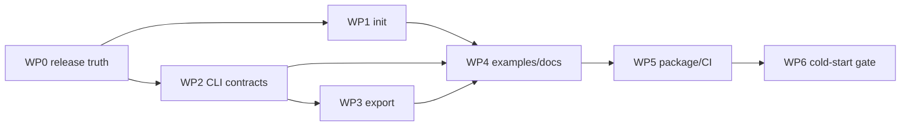

# Beacon v0.2 — Publishable Static Product Plan

**Status:** READY FOR IMPLEMENTATION
**Date:** 2026-08-09
**Owner:** Beacon
**Parent roadmap:** `docs/beacon-functional-product-roadmap.md` — v0.2
**Starting commit:** `77ad631`
**Target release:** `0.2.0`
**Release decisions approved:** 2026-08-09
**Implementation addendum:** `.agent/plans/beacon-v0.2-implementation-readiness-addendum-2026-08-09.md`

## 1. Outcome

Ship Beacon as a dependable local product that a maintainer can install, initialize, review, export,
and connect to a coding agent without editing Python or asking the Beacon maintainer for help.

The release is complete when a maintainer unfamiliar with Beacon can go from an existing repository
to a validated, inspected, source-cited local Beacon in 15 minutes, using only the CLI and docs.

v0.2 product loop:

```text
install wheel
  -> beacon init
  -> review beacon.yaml
  -> beacon validate --strict-warnings
  -> beacon inspect --task-hint "..."
  -> beacon export
  -> connect MCP client / beacon serve
  -> commit beacon.yaml + reviewed snapshot if desired
```

## 2. Current baseline

The release starts from a working manifest-driven product, not from zero.

| Capability | Current state | v0.2 disposition |
| --- | --- | --- |
| Manifest schema/loader/validator | Shipped, `beacon_version: "0.1"` | Preserve compatibility |
| Canonical Markdown doc index | Shipped, deterministic | Reuse in export and inspect |
| Five read-only MCP tools | Shipped | Freeze names, inputs, and answer dataclasses |
| `beacon` stdio server | Shipped as no-argument default | Preserve; add explicit `serve` alias |
| `beacon validate PATH` | Shipped | Add defaults, JSON, strict warnings |
| `beacon inspect PATH` | Shipped | Add defaults, task hint, JSON |
| Self-referential `beacon.yaml` | Shipped and clean | Keep as release smoke fixture |
| Offline tests | 59 passing at `77ad631` | Expand to CLI/export/init/package contracts |
| `beacon init` | Missing | Build safely and deterministically |
| Canonical export/snapshot | Missing | Build reviewable static export |
| Examples | Missing | Add library, service, monorepo/research examples |
| Dedicated client setup guide | README only | Add one tested guide |
| Golden CLI output contracts | Partial assertions only | Add JSON contract and stable fixture tests |
| Distribution/release metadata | Inconsistent/incomplete | Resolve before package publication |
| MCP framework dependency | Legacy `cth-mcp-framework` editable install | Migrate to public Archolith distribution |
| Release CI | Missing | Add test/build/wheel-smoke workflow |
| Repository ignore rules | No `.gitignore` | Add Python/build/output hygiene |
| Git release tags | None | Create only after release gate passes |

Known release-truth conflict: README already uses the approved distribution name
`archolith-beacon`, while `pyproject.toml` still declares `name = "beacon"`. WP0 must make the
metadata consistent and successfully reserve/publish the distribution under Archolith ownership
before documenting installation as complete.

Dependency release prerequisite: Beacon still declares `cth-mcp-framework>=0.1.0` and imports
`cth_mcp_framework`. The framework has migrated to
`Archolith/archolith-mcp-framework`, distribution `archolith-mcp-framework`, import
`archolith_mcp_framework`, and tag `v0.2.0`, but is not yet available from the public package index.
WP0 must publish that framework first and must not put a direct Git dependency in Beacon's public
package metadata.

## 3. Locked decisions

These decisions keep v0.2 small and prevent v0.3 architecture from leaking into the release.

1. **Static and offline:** no database, network, external service, embeddings, or runtime LLM.
2. **Read-only:** Beacon does not modify source files except the explicit `init` output selected by
   the maintainer.
3. **Public MCP freeze:** no sixth tool and no incompatible change to the five tool names, inputs,
   provider methods, or answer dataclasses.
4. **Manifest compatibility:** generated manifests use `beacon_version: "0.1"`; no new required
   manifest field.
5. **CLI compatibility:** running `beacon` with no subcommand continues to start stdio. An explicit
   `beacon serve` command is additive.
6. **Deterministic automation:** `init` is non-interactive by default; `export` is byte-stable for
   unchanged inputs; machine output is JSON on stdout with diagnostics on stderr.
7. **Safe generation:** `init` never overwrites an existing file unless `--force` is explicit, and
   `--dry-run` performs no write.
8. **Honest discovery:** generated values come only from bounded repository evidence. Unknown setup,
   test, architecture, or guardrail values remain review items; Beacon does not invent commands.
9. **Snapshot boundary:** the v0.2 export is a static, canonical source snapshot for review, CI, and
   future fallback. It does not introduce the v0.3 normalized multi-adapter knowledge envelope.
10. **No release claim without a wheel:** source-checkout success is insufficient; the built wheel
    must install and run in a clean environment.
11. **Approved release contracts:** the package, platform, review-report, snapshot, CLI envelope,
    overwrite, and release-workflow decisions in section 10 are implementation requirements.
12. **Readiness contract:** MCP baseline, resource limits, acknowledgement policy, secret blocking,
    privacy, executable schemas, and release-candidate order follow the implementation addendum.

## 4. Supported maintainer journey

### Step 1 — Install and identify the binary

```text
python -m pip install archolith-beacon==0.2.0
beacon --version
beacon --help
```

Requirements:

- distribution `archolith-beacon`, import package `beacon`, and CLI command `beacon`;
- public dependency `archolith-mcp-framework>=0.2,<0.3`, imported as
  `archolith_mcp_framework`, with no legacy or direct-URL requirement;
- one version source used by package metadata and `beacon --version`;
- useful help without environment variables; and
- CPython `>=3.12,<3.15`, tested on Python 3.12, 3.13, and 3.14 across Windows, macOS, and Linux.

### Step 2 — Initialize

```text
cd existing-project
beacon init
beacon init --dry-run
beacon init path/to/project --output path/to/beacon.yaml
```

`init` discovers a conservative starter manifest from bounded signals:

- project name from the repository directory;
- repository URL from the configured git remote, with credentials/userinfo removed;
- language hints from known build files;
- license from a known license filename;
- canonical entry docs from an allowlist of files that exist;
- setup/test commands only when a supported build file provides an unambiguous command; and
- explicit review-report entries for unknown purpose, guardrails, and uncertain commands.

The discovery allowlist should include common agent/project entry points such as `README.md`,
`CONTRIBUTING.md`, `AGENTS.md`, `.agent/README.md`, and bounded architecture/index files under
`docs/`. It must exclude `.git`, virtual environments, build outputs, generated artifacts, hidden
secrets, and files outside the selected repository root.

`init` requirements:

- deterministic ordering and YAML output;
- relative, normalized manifest paths;
- no recursive content ingestion;
- no path escape through symlinks or `..`;
- no overwrite by default; `--force` replaces only an existing recognizable Beacon manifest;
- atomic write when it does write;
- an explicit structured summary of discovered, omitted, and review-required fields;
- `--format json` for the report and optional `--report PATH` persistence without a surprise
  second file by default;
- no authoritative review state stored only in YAML comments;
- optional unknown fields omitted or empty, and required unknown values stated factually with the
  enclosing knowledge status set to `unknown`; and
- generated output parses and has zero validation errors.

Warnings are acceptable immediately after generation when a real value is unknown. Publication is
gated by `validate --strict-warnings`, so the maintainer must resolve them rather than accept guesses.

### Step 3 — Validate and inspect

```text
beacon validate
beacon validate path/to/beacon.yaml --strict-warnings
beacon validate --format json
beacon inspect
beacon inspect --task-hint "add a parser regression test"
beacon inspect --format json
```

Both commands default to `./beacon.yaml` while retaining positional-path compatibility.

Shared CLI behavior:

- `--docs-root` overrides path resolution consistently;
- text is the human default;
- `--format json` emits one `beacon.cli-result` version `1.0` envelope on stdout;
- the envelope carries `command`, `ok`, command-specific `result`, and diagnostics with stable
  `severity`, `code`, `path`, and `message` fields;
- expected machine-mode outcomes produce exactly one JSON document and no human prose;
- stderr is reserved for logs and failures that occur before an envelope can be built;
- exit `0` means the command completed under the selected policy;
- exit `1` means validation or strict-warning failure;
- exit `2` means invalid arguments, missing inputs, unsafe paths, or refused overwrite;
- exit `3` means an unexpected internal failure; and
- Unicode output works on Windows without corrupting machine JSON.

`export --output -` emits the raw versioned snapshot rather than a CLI envelope, and `serve` emits
MCP stdio. These are protocol/artifact streams, not ordinary CLI results.

`inspect --task-hint` must exercise task-scoped onboarding and guardrails rather than only the
provider's no-argument defaults. JSON inspection returns the complete payload for all five tools,
not the truncated human presentation.

### Step 4 — Export

```text
beacon export
beacon export --output beacon.snapshot.json
beacon export --output -
beacon export --metadata-only
```

The canonical export is a self-contained JSON representation of the static Beacon inputs, suitable
for code review and CI diffing. It includes:

- `beacon_snapshot_version: "1.0"`;
- generator distribution/version and `content_mode: "embedded"` or `"metadata_only"`;
- project identity and `beacon_version`;
- canonical serialized manifest data;
- manifest SHA256;
- canonical docs with relative path, role, status, title, content SHA256, and heading chunks with
  line ranges and text; and
- source/build metadata required to explain how the snapshot was constructed, excluding volatile
  wall-clock fields from canonical content.

Canonicalization rules:

- UTF-8, final newline, sorted mapping keys, stable list ordering;
- repository-relative forward-slash paths;
- no absolute local paths, environment values, credentials, timestamps, or host identifiers;
- identical bytes for unchanged inputs; and
- atomic file replacement, with stdout mode performing no file write.

The default snapshot embeds each canonical heading chunk's text once. It does not also duplicate
the complete document body. `--metadata-only` emits document metadata, structure, and hashes
without text. Documentation must state plainly that the default snapshot contains the selected
canonical documents' content.

The snapshot is a review/export artifact in v0.2. Loading and querying snapshots as a provider
fallback is v0.3 work unless it can be added without delaying the v0.2 exit gate.

### Step 5 — Serve and connect

```text
beacon serve --manifest beacon.yaml
# compatibility path remains valid:
BEACON_MANIFEST_PATH=/absolute/path/to/beacon.yaml beacon
```

Requirements:

- explicit `serve` command with CLI path/docs-root options;
- no-argument environment-driven stdio remains byte/behavior compatible;
- startup reports project, manifest path, validation status, and provider mode to stderr only;
- tool stdout remains reserved for MCP framing; and
- shutdown/invalid-manifest behavior is covered by a process smoke test.

## 5. Work packages

### WP0 — Release truth and repository hygiene

Purpose: remove ambiguity before adding user-facing commands.

Files likely involved:

- `pyproject.toml`
- `src/beacon/__init__.py`
- `src/beacon/main.py`
- `src/beacon/mcp/server.py`
- `README.md`
- `LICENSE`
- `.gitignore`
- `.github/workflows/ci.yml`
- release documentation

Tasks:

1. Change package metadata to the approved distribution `archolith-beacon`; retain import package
   and CLI name `beacon`; verify package-index availability and Archolith ownership before upload.
2. Publish `archolith-mcp-framework==0.2.0` from its canonical Archolith repository, then replace
   Beacon's legacy dependency/imports with `archolith-mcp-framework>=0.2,<0.3` and
   `archolith_mcp_framework`. Preserve the five-tool behavior through compatibility tests.
3. Make version metadata single-source and expose `beacon --version`.
4. Add complete package metadata: README, license, repository/issues URLs, classifiers, and package
   inclusion checks.
5. Add `.gitignore` for Python bytecode, virtual environments, build outputs, coverage, local env,
   and generated snapshots while allowing committed example snapshots when explicitly located.
6. Declare CPython `>=3.12,<3.15` and test Python 3.12/3.13/3.14 on Windows, macOS, and Linux; do
   not claim PyPy, free-threaded, Python 3.15 prerelease, or mobile support.
7. Add build/test dependencies or documented tool installation for `python -m build` and package
   metadata validation.
8. Keep `master` as protected trunk; use `release/v0.2.0`, PR into `master`, annotated `v0.2.0`
   tagging after merge, and tag-triggered trusted publication. Correct the hook's stale message.

Acceptance:

- package name and install docs agree;
- the framework installs from the public index under its Archolith name and Beacon contains no
  legacy `cth-mcp-framework` or direct-URL dependency;
- `beacon --version` equals built metadata;
- wheel/sdist contain expected code, README, and license only;
- no bytecode/build junk appears in `git status`; and
- a clean wheel install can run help, version, validate, and inspect.

### WP1 — Safe repository discovery and `beacon init`

Purpose: create the first usable product entry point.

Suggested modules:

- `src/beacon/core/discovery.py` — pure bounded repository observations
- `src/beacon/core/scaffold.py` — starter manifest model/render/atomic write
- `src/beacon/main.py` — thin Typer command
- `tests/test_init.py` or focused additions to `tests/test_cli.py`

Tasks:

1. Define frozen discovery/result dataclasses, including evidence and review-required fields, and
   serialize the initialization report through the shared CLI envelope.
2. Implement bounded marker/doc detection with normalized relative paths.
3. Sanitize git remote URLs and refuse paths outside the selected root.
4. Render deterministic YAML without mutating the existing manifest schema.
5. Implement default refusal, `--dry-run`, `--output`, and `--force` only for a recognizable Beacon
   manifest that is a regular in-root file; never provide a generic arbitrary-file overwrite flag.
6. Write atomically and clean temporary files on failure.
7. Report what was discovered, skipped, and left for review in text and JSON.

Negative tests:

- existing manifest remains byte-identical without `--force`;
- unrelated files, directories, symlinks, and path escapes are refused even with `--force`;
- dry run creates nothing;
- credential-bearing git remote is sanitized;
- symlink/path escape is rejected;
- secret/generated/venv files are not proposed as canonical docs;
- unknown build system does not generate a fake test command;
- interrupted write leaves no partial manifest; and
- repeated discovery returns the same output.

### WP2 — Coherent CLI and machine contracts

Purpose: make the current capabilities scriptable and consistent.

Files likely involved:

- `src/beacon/main.py`
- a small shared CLI result/render module under `src/beacon/core/` or `src/beacon/cli/`
- `src/beacon/config/settings.py`
- `tests/test_cli.py`
- `.agent/architecture.md`

Tasks:

1. Add an explicit `serve` command while preserving no-argument stdio.
2. Add default manifest discovery (`./beacon.yaml`) to validate/inspect/export.
3. Add consistent `--docs-root`, `--format text|json`, and the approved 0/1/2/3 exit codes.
4. Add `--strict-warnings` to validation.
5. Add task-hint inspection that invokes task-scoped onboarding and guardrails.
6. Implement the shared `beacon.cli-result` `1.0` envelope and keep stdout/stderr separation safe
   for MCP, snapshot, and JSON consumers.
7. Centralize manifest loading, docs-root resolution, validation, and error normalization so commands
   do not drift.

Acceptance:

- old positional commands continue to pass;
- no-argument server behavior remains covered;
- every command has help, success, user-error, and JSON tests;
- JSON outputs are parsed and schema-asserted, not matched as prose; and
- Windows UTF-8 and path tests pass.

### WP3 — Canonical static snapshot and `beacon export`

Purpose: give maintainers a reviewable, diffable product artifact.

Suggested modules:

- `src/beacon/core/snapshot.py`
- `src/beacon/core/canonical_json.py`
- `src/beacon/main.py`
- `tests/test_snapshot.py`

Tasks:

1. Define frozen snapshot dataclasses/schema with `beacon_snapshot_version: "1.0"`, independent
   generator/manifest versions, and explicit embedded/metadata-only content modes.
2. Reuse loader, validator, and `DocIndex` chunking; do not implement a second parser.
3. Compute source digests from exact bytes and normalize only the exported representation.
4. Reject dangling/escaping docs before export.
5. Implement stable JSON serialization, default embedded chunk text, `--metadata-only`, and atomic
   output.
6. Document snapshot stability guarantees and deliberate non-guarantees.

Acceptance:

- two unchanged exports have identical SHA256;
- changing one canonical doc changes its digest and snapshot bytes;
- no absolute path, secret env value, timestamp, or hostname appears;
- line ranges resolve to the exported chunk text;
- invalid manifests/docs produce no output file; and
- a golden snapshot fixture detects accidental schema drift.

### WP4 — Examples, setup docs, and five-minute demonstration

Purpose: prove Beacon is understandable outside its own repository.

Deliverables:

- `examples/library/`
- `examples/service/`
- `examples/monorepo-research/`
- `docs/client-setup.md`
- updated `docs/demo-transcript.md`
- updated README quick start

Each example includes a valid manifest, minimal canonical docs, expected validation result, and a
small task hint that demonstrates onboarding and guardrails. Examples must use different project
shapes rather than three renamed copies of Beacon's own manifest.

Client setup documentation covers supported stdio clients from one canonical environment/command
model. Examples are tested for path validity and all five provider capabilities in CI.

Acceptance:

- every example validates with zero errors;
- strict-warnings policy is either clean or explicitly explains a deliberate warning;
- inspect/export succeed for every example;
- copy/paste client configurations use the canonical distribution and CLI; and
- the demo begins at installation/init, not from a preconfigured maintainer checkout.

### WP5 — Packaging, CI, and release candidate

Purpose: prove the product works outside the development checkout.

CI gates:

1. full offline tests;
2. self-manifest validation and inspection;
3. example validate/inspect/export matrix;
4. deterministic export comparison;
5. sdist/wheel build and metadata check;
6. clean-environment wheel install and CLI smoke;
7. the complete CPython 3.12/3.13/3.14 × Windows/macOS/Linux matrix; and
8. repository cleanliness after tests.

Release candidate process:

- publish and smoke-test `archolith-mcp-framework==0.2.0` from the public package index before
  building Beacon's release candidate;
- build from a clean commit;
- install the wheel into a fresh virtual environment;
- execute the complete maintainer journey against a temporary repository;
- record artifact SHA256 values;
- publish a release candidate to a controlled target first when needed;
- verify installation as `archolith-beacon`;
- merge the passing `release/v0.2.0` PR into protected `master`;
- create annotated tag `v0.2.0` on the exact merged commit; and
- create the GitHub release and publish through trusted tag-triggered automation only after the
  scorecard passes.

No secrets or publishing credentials belong in ordinary pull-request CI.

### WP6 — Cold-start usability and release scorecard

Purpose: test the product claim, not only the code.

Run one scripted trial for each maintained example and at least one unaided trial with a developer
who did not write the implementation.

Measure:

- install success and time;
- time to a generated manifest;
- validation errors/warnings and time to resolution;
- time to understand inspect output;
- time to connect an MCP client;
- whether the agent identifies expected docs/files/commands/guardrails for the example task; and
- every point where the user needs undocumented maintainer knowledge.

Exit target:

- complete local setup in 15 minutes;
- zero undocumented blocking step;
- zero unsupported high-confidence claim in maintained example outputs;
- all citations resolve;
- all five tools respond;
- init/export are deterministic and safe; and
- the wheel, not an editable checkout, passes the journey.

Usability failures create blocking v0.2 fixes, not post-release documentation TODOs.

## 6. Dependency order and merge strategy



Recommended merge units:

1. release metadata, ignore rules, and command-contract decision record;
2. pure discovery/scaffold core plus unit tests;
3. `beacon init` CLI and negative-path tests;
4. shared CLI loading/rendering plus validate/inspect compatibility;
5. explicit serve/version behavior;
6. snapshot core and deterministic golden fixture;
7. `beacon export` CLI;
8. examples and client/demo documentation;
9. CI/build/wheel smoke; and
10. usability fixes and release notes.

Do not combine all commands into one unreviewable CLI rewrite. Each unit must leave the old five MCP
tools and existing manifest behavior green.

## 7. Verification matrix

Minimum local commands at final review:

```text
python -m pytest -p no:cacheprovider -q
python -m beacon --help
python -m beacon --version
python -m beacon validate beacon.yaml --strict-warnings
python -m beacon inspect beacon.yaml --format json
python -m beacon export beacon.yaml --output <temporary-path>
python -m beacon export beacon.yaml --output <second-temporary-path>
python -m build
python -m twine check dist/*
```

Then compare the two export hashes, install the built wheel in a fresh environment, and rerun
version/help/validate/inspect/export from outside the repository.

Test inventory must cover:

- unit: discovery, scaffold rendering, URL/path sanitation, canonical JSON, snapshot digests;
- CLI: every command/flag/exit code/text/JSON path;
- compatibility: existing v0.1 manifest and five MCP tools;
- examples: library/service/monorepo matrix;
- packaging: wheel contents and installed console script; and
- process: stdio startup, stderr/stdout separation, invalid startup.

If a formatter/linter/type checker is adopted in WP0, its exact command becomes a required gate and
is added to `.agent/workflows/code_conventions.md`.

## 8. Release acceptance checklist

### Product

- [ ] Fresh repository can initialize without source edits.
- [ ] Generated manifest has zero errors and clearly named review items.
- [ ] Strict validation can become clean without undocumented schema knowledge.
- [ ] Inspect exercises all five tools and task-scoped behavior.
- [ ] Export is canonical, source-cited, and byte-stable.
- [ ] Explicit serve and legacy no-argument stdio both work.
- [ ] Three project-shape examples pass in CI.
- [ ] Cold-start journey completes in 15 minutes.

### Safety and compatibility

- [ ] Init refuses overwrite and path escape.
- [ ] `--force` replaces only a recognizable in-root Beacon manifest and replacement is atomic.
- [ ] Git remote credentials, environment secrets, and absolute local paths do not leak.
- [ ] v0.1 manifests and existing five-tool contracts remain compatible.
- [ ] Unknown facts remain warnings/review items rather than guesses.
- [ ] Failed init/export leaves no partial artifact.
- [ ] Tests leave the repository clean.

### Distribution

- [ ] `archolith-mcp-framework==0.2.0` is publicly installable from its Archolith release.
- [ ] Beacon depends on `archolith-mcp-framework>=0.2,<0.3` with the new import namespace.
- [ ] Beacon has no direct Git dependency or legacy `cth-mcp-framework` runtime requirement.
- [ ] Canonical distribution name is verified and consistent.
- [ ] Version is single-source and reports `0.2.0`.
- [ ] Wheel and sdist metadata pass validation.
- [ ] Clean wheel installation passes CLI and example smoke tests.
- [ ] Release branch/tag workflow is documented and compatible with repository hooks.
- [ ] Release notes state actual supported platforms and remaining limitations.

## 9. Explicitly deferred to v0.3+

- code/symbol/git/benchmark source adapters beyond conservative init discovery;
- incremental refresh and invalidation;
- querying a snapshot as a provider fallback;
- normalized multi-adapter knowledge/View envelope;
- lifecycle/time-mode search filters;
- Menhir or any dynamic provider;
- remote transport/auth/operations;
- runtime LLM synthesis;
- durable agent-submitted unanswered-question storage and maintainer review workflow; and
- new MCP tools.

Deferral is important: v0.2 succeeds by making the static product installable and trustworthy, not
by beginning every later architecture layer.

## 10. Approved v0.2 release decisions

1. **Distribution and ownership:** first publish `archolith-mcp-framework==0.2.0` from
   `Archolith/archolith-mcp-framework`; migrate Beacon to dependency
   `archolith-mcp-framework>=0.2,<0.3` and import `archolith_mcp_framework`; then publish
   `archolith-beacon` under Archolith ownership. Both public distributions use trusted GitHub
   publication and at least two maintainers. Keep `beacon` as Beacon's import and CLI name. Public
   metadata contains no direct Git dependency.
2. **Supported matrix:** support CPython 3.12, 3.13, and 3.14 on Windows, macOS, and Linux. Exclude
   Python 3.15 prereleases, PyPy, free-threaded builds, and mobile until separately tested.
3. **Unknown/review state:** keep guesses out of the manifest. Omit optional unknowns; mark required
   unknown knowledge factually with `status: unknown`; expose a structured initialization report in
   text or the shared JSON envelope; persist it only through optional `--report PATH`. YAML comments
   may guide editing but are never authoritative review state. Strict warnings block publication.
4. **Snapshot:** use snapshot schema `1.0`, independent of product `0.2.0` and manifest `0.1`.
   Embed canonical heading-chunk text once by default; offer explicit `--metadata-only`; record the
   content mode and exact source digests.
5. **CLI JSON:** use shared envelope `beacon.cli-result` version `1.0` with `command`, `ok`,
   command-specific `result`, and stable diagnostics. Raw snapshot stdout and MCP stdio remain
   separately versioned streams. Use exit codes 0 success, 1 validation/policy failure, 2 user/input
   safety failure, and 3 unexpected internal failure.
6. **Overwrite:** `--force` is sufficient only for an existing recognizable Beacon manifest that
   is a regular file inside the repository root. Validate and atomically replace it. Never overwrite
   unrelated files, directories, symlinks, or path escapes, and provide no arbitrary-file escape
   hatch.
7. **Release workflow:** keep `master` as protected trunk. Implement on `release/v0.2.0`, merge by
   passing PR, annotate the exact merged commit as `v0.2.0`, and trigger GitHub Release/trusted
   package publication only from that tag. Delete the release branch after successful publication.

These decisions are locked for v0.2. Changing one requires updating its fixtures, command examples,
acceptance checks, and this plan before implementation diverges.

## 11. Implementation readiness contract

The normative implementation details and executable JSON Schema fixtures live in
`.agent/plans/beacon-v0.2-implementation-readiness-addendum-2026-08-09.md`. Implementation begins
with that addendum's dependency/protocol gate, bounded readers, diagnostic policy, and schemas.

The addendum keeps v0.2 on stable FastMCP 3.x/stdio, defines the supported small-to-medium resource
profile, allows reasoned acknowledgement only for absent tests/guardrails, blocks high-confidence
secrets unless explicitly recorded, guarantees offline/telemetry-free runtime behavior, and fixes
the framework → Beacon RC → Beacon final publication sequence.
