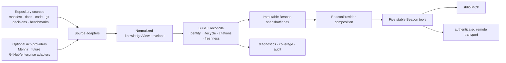
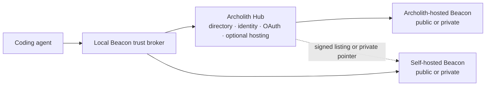

# Beacon Functional Product Roadmap

> Status: canonical product roadmap
> Date: 2026-08-09
> Scope: Beacon from the shipped manifest-driven v0 to a usable, operable v1 product

## 1. Product outcome

Beacon v1 is a project knowledge product, not merely an MCP demo or a Menhir adapter.

A maintainer can point Beacon at a repository, review what it will publish, keep it fresh, and expose
it locally or remotely. A coding agent can connect and get current, source-cited orientation,
task-specific files and commands, decision history, and safety guidance without reverse-engineering
the repository from scratch.

The product sentence remains:

> Beacon is the missing handshake between software projects and coding agents.

The functional promise is more concrete:

> Publish a trustworthy, living project knowledge surface that helps an agent begin useful work
> safely in minutes.

## 2. Primary users and jobs

### Repository maintainer

The maintainer needs to:

- initialize Beacon without hand-authoring a large schema;
- see exactly what knowledge and files will be exposed;
- validate citations, status, freshness, and risky guidance before publication;
- run locally with no service dependency;
- opt into richer repository, git, benchmark, or Menhir-backed knowledge;
- publish a remote endpoint with authentication and health checks; and
- detect when canonical knowledge becomes stale or contradictory.

### Coding agent

The agent needs to:

- identify the project and its current purpose;
- get a task-scoped read order, relevant files, commands, and guardrails;
- distinguish current, experimental, disputed, and superseded knowledge;
- trace every material claim to a source;
- understand why a decision exists and what it replaced;
- detect uncertainty instead of receiving a confident guess; and
- continue working when dynamic providers are unavailable by using a reviewed snapshot or manifest.

### Platform operator or tool integrator

The operator needs to:

- configure stdio and remote transports consistently;
- authenticate remote consumers and isolate projects/tenants;
- observe refresh failures, stale indexes, latency, and source coverage;
- pin a schema/contract version and test compatibility; and
- deploy without giving Beacon write access to source repositories.

### External Beacon consumer

The consumer needs to:

- discover a public or authorized private Beacon by stable project identity;
- verify that the endpoint represents the intended repository and publisher;
- understand whether Archolith or the project owner hosts and can read the data;
- connect through a local trust broker without teaching every agent a new security protocol;
- see trust, freshness, snapshot lineage, and remote provenance before using answers; and
- revoke a remote Beacon locally without depending on the remote operator.

## 3. Definition of a functional v1

Beacon is a functional product when all of the following are true.

### Publish and operate

- `beacon init` creates a valid starter manifest and source configuration for a supported repository.
- `beacon validate`, `beacon inspect`, and `beacon serve` provide one coherent local workflow.
- `beacon build` or `beacon refresh` produces an immutable, inspectable Beacon snapshot.
- A maintainer can run Beacon over stdio or authenticated remote transport.
- Startup, health, readiness, source coverage, and last-successful-refresh state are observable.
- Manifest-only/snapshot mode works with no database, network, or runtime LLM dependency.

### Help an agent complete real work

- All five existing tools return useful answers for at least three project shapes: library, service,
  and monorepo/research project.
- Task onboarding identifies relevant docs, files, tests, commands, and risks for a small real change.
- Search covers docs, code/file metadata, decisions, git changes, benchmarks, and provider memories
  when those sources are configured.
- Current and superseded decisions are distinguishable through the stable answer contracts.
- Unsupported or stale knowledge lowers confidence or returns uncertainty; it is never silently
  promoted to current high-confidence guidance.

### Be trustworthy enough to use

- Every high-confidence material claim in the release fixture set has at least one resolvable source.
- Current/superseded and cross-project isolation gates pass 100% of deterministic fixtures.
- Rebuilding unchanged inputs is idempotent and produces a content-identical canonical snapshot.
- Removing or changing a source invalidates or refreshes dependent records predictably.
- Existing `beacon.yaml` v0.1 projects continue to load, or a tested migration explains the change.
- Provider failures degrade to an explicit fallback or error state rather than fabricated answers.
- A local trust broker verifies remote identity, publisher, endpoint, authorization, and snapshot
  lineage before exposing another project's Beacon as trusted.
- Archolith-hosted and self-hosted Beacons pass the same identity, answer, isolation, and revocation
  conformance fixtures.

## 4. Product boundaries

### In v1

- static manifest and canonical-doc publishing;
- repository-aware docs, file, symbol, git, decision, guardrail, and benchmark sources;
- a normalized, versioned knowledge/View envelope;
- deterministic snapshot build and local query;
- hybrid manifest plus dynamic-provider answers;
- source citations, lifecycle state, confidence, freshness, and provenance;
- stdio MCP and authenticated remote MCP/HTTP operation;
- portable Beacon identity, signed discovery/trust metadata, and local trust receipts;
- an optional Archolith Hub for directory, trust assertions, public/private hosting, and question
  review while direct/self-hosted operation remains conforming;
- CLI setup, inspection, refresh, export, health, and diagnostics;
- compatibility suite, examples, and operator documentation; and
- Menhir as the first rich temporal provider, not as a requirement.

### Outside v1

- autonomous code changes or repository writes;
- replacing git, issue trackers, or documentation systems;
- a universal ontology for every engineering organization;
- mandatory runtime LLM synthesis;
- broad enterprise connectors before the local/repository product is reliable;
- mandatory Archolith hosting or accounts for direct/self-hosted operation;
- billing, paid marketplace placement, or a multi-region commercial SLA before core Hub use is
  validated; and
- treating LongMemEval scores as proof that Beacon helps agents on software projects.

## 5. Product architecture

The public tools stay stable while the provider interior becomes composable.

### Stable public layer

Keep the existing five capabilities through the v1 build:

- `beacon_project_overview`
- `beacon_agent_onboarding`
- `beacon_search`
- `beacon_explain_concept`
- `beacon_guardrails`

Add optional fields only when a compatibility test proves old clients still work. Decision tracing
and change explanations should first be expressed through these contracts or provider composition.
New tools such as `beacon_trace_decision` and `beacon_what_changed` enter only after the v1 core
workflows are useful and the versioning policy is in place.

### Normalized knowledge/View envelope

All adapters converge on a versioned record independent of Neo4j labels, scalar presentation
strings, a particular search engine, or a particular manifest shape. At minimum it carries:

- project/namespace identity;
- stable record key and kind;
- title and typed payload;
- lifecycle state and predecessor/successor identity;
- validity, learned, observed, and refreshed times where applicable;
- confidence plus the reason for that confidence;
- source citations and source-content digests;
- adapter/provider version; and
- freshness/invalidity state.

The immutable snapshot contains canonical ordering and a schema version so it can be diffed,
reviewed, cached, signed later, and used as the dynamic-provider fallback.

### Provider composition

The product should evolve from a single `ManifestBeaconProvider` to explicit composition:

- manifest/docs remain the trusted bootstrap and fallback;
- repository adapters add deterministic file, symbol, git, decision, and benchmark records;
- Menhir adds temporal memory and richer supersession/history;
- a policy layer merges records, resolves lifecycle state, and fails closed on ambiguity; and
- answer composers map normalized records into the existing five answer dataclasses.

Provider selection must be configuration, not import-time magic. Startup must state which providers
are active, their last refresh, and whether the server is serving live, degraded, or snapshot-only
knowledge.

### Optional AI answer broker boundary

Beacon may eventually place an AI answer broker between canonical Beacon knowledge and a consumer
that asks a broader question. The broker is optional and cannot replace the deterministic snapshot,
provider, or citation contracts. Regardless of whether a response is assembled deterministically or
synthesized by a model, the public result remains a versioned Beacon-shaped response.

Model output is never forwarded directly. It must pass strict response-schema and citation
validation and identify its responder, synthesis mode, source snapshot digest, grounded facts,
inferences, and uncertainties. Repository content is untrusted data rather than model instruction;
input/output size, time, tool, network, persistence, and write capabilities are bounded and disabled
unless explicitly authorized. Secret filtering applies before and after synthesis. If the model
output is malformed, unsupported, or has unresolved citations, the broker discards it and returns a
Beacon-shaped `unanswered`, `refused`, or `error` response. Unanswered-question persistence remains
a separate authenticated capability and never promotes submitted or synthesized text to trusted
project knowledge without maintainer policy and cited publication.

### Distribution and trust plane

Archolith is the default directory, trust service, and optional host. A local Beacon trust broker
resolves and verifies hosted or self-hosted remotes before exposing them to an agent. Direct mode
must remain functional without the Hub.

The detailed contract and phased implementation live in
[`../.agent/plans/beacon-trust-hub-and-federation-plan-2026-08-09.md`](../.agent/plans/beacon-trust-hub-and-federation-plan-2026-08-09.md).

## 6. Release sequence

Each release must produce something a user can operate; none is merely an internal abstraction
milestone.

### v0.2 — Publishable static Beacon

Goal: make the shipped v0 pleasant and dependable for a real repository.

Execution plan:
[`../.agent/plans/beacon-v0.2-publishable-static-product-plan-2026-08-09.md`](../.agent/plans/beacon-v0.2-publishable-static-product-plan-2026-08-09.md)

Implementation readiness addendum:
[`../.agent/plans/beacon-v0.2-implementation-readiness-addendum-2026-08-09.md`](../.agent/plans/beacon-v0.2-implementation-readiness-addendum-2026-08-09.md)

Deliverables:

- `beacon init` with conservative repository detection and a reviewable generated manifest;
- `beacon validate`, `inspect`, and local smoke-test output with actionable diagnostics;
- `beacon export` for a canonical JSON snapshot of manifest/docs knowledge;
- examples for a library, service, and monorepo/research project;
- complete client setup docs for supported MCP clients;
- golden outputs and contract tests for all five tools;
- package/release automation, version reporting, and installation smoke tests; and
- a five-minute demo that starts from a fresh repository.

Exit gate:

> A maintainer unfamiliar with Beacon can initialize, inspect, and connect a local agent in 15
> minutes without asking the Beacon maintainer for help.

### v0.3 — Repository-aware Beacon

Goal: make Beacon useful for a small coding task without requiring Menhir.

Deliverables:

- read-only adapters for Markdown/docs, file inventory, selected symbols, git commits/diffs, explicit
  decision records, guardrails, and benchmark/result metadata;
- source configuration with include/exclude rules and secret/generated-file safety defaults;
- portable `beacon_id`, discovery-descriptor fixtures, and local signed-snapshot verification;
- normalized knowledge envelope plus backward-compatible snapshot 1.x records and loader/fallback
  support for the v0.2 snapshot contract;
- deterministic build/refresh with source digests and incremental invalidation;
- task onboarding that ranks docs, files, tests, commands, and risks together;
- search filters for source type, lifecycle state, and optional time mode;
- a durable, source-cited unanswered-question queue with `open`, `answered`, `deferred`, and
  `superseded` states so agents can submit knowledge gaps for later maintainer review without
  promoting them to trusted project knowledge;
- source-coverage and stale-citation diagnostics.

Exit gate:

> On three representative repositories, an agent can prepare a correct small docs/test/fixture change
> using Beacon, with no unsupported high-confidence claims in the release fixture set.

### v0.5 — Dynamic and temporal Beacon

Goal: support living project knowledge and history while preserving the static fallback.

Deliverables:

- provider composition and explicit live/degraded/snapshot-only modes;
- generic current/superseded View semantics and decision lineage;
- `MenhirBeaconProvider` over the normalized envelope boundary;
- one current decision, one superseded predecessor, and cited project status proven end to end;
- refresh scheduling, idempotent rebuild, conflict/ambiguity handling, and last-known-good snapshot;
- publisher/server key rotation, signed snapshot lineage, anti-rollback checks, and local trust
  receipts;
- unanswered-question moderation, deduplication, answer, and source-cited promotion workflow;
- dynamic answers across all five existing tools, not just search; and
- optional decision/change views exposed compatibly before any new MCP tool is added.

Exit gate:

> Beacon answers “what is current, what changed, and why?” from mixed static and temporal sources,
> cites the evidence, survives provider loss, and never presents the predecessor as current.

### v0.8 — Operable remote product

Goal: make Beacon safe to discover, trust, host, and use across project ownership boundaries.

Deliverables:

- Archolith Hub alpha as the default directory, trust service, and optional public/private host;
- self-hosted public/private federation and direct operation without a Hub query-time dependency;
- local trust broker and stdio bridge for verified remote access;
- current stateless MCP/Streamable HTTP with Beacon trust preflight, signed descriptor/proof, and
  namespaced trust metadata;
- OAuth/resource binding, separate read/question/publish/admin scopes, and project authorization;
- centralized unanswered-question submission/moderation with abuse controls;
- health, readiness, version, active-provider, snapshot-age, and source-coverage endpoints;
- structured logs, request/refresh correlation, latency/error metrics, and audit events;
- bounded caches, timeouts, retries, circuit breaking, and last-known-good serving policy;
- container/deployment artifacts and local single-process deployment guide;
- configuration validation, secret redaction, path traversal protections, and threat model;
- snapshot backup/restore and rollback; and
- load/concurrency tests for documented operating limits.

Exit gate:

> An external user can verify and use an Archolith-hosted or self-hosted public Beacon; an
> authorized user can connect to a private Beacon; identity, rollback, revocation, and cross-project
> isolation failures all fail closed; and a provider or Hub outage degrades explicitly.

### v1.0 — Functional Beacon product

Goal: ship a stable product and compatibility promise.

Deliverables:

- versioned manifest, snapshot, normalized-record, provider, and answer-contract specifications;
- backward-compatibility and migration policy with executable fixtures;
- provider conformance kit and reference adapters;
- end-to-end evaluation suite covering onboarding, citations, lifecycle, freshness, guardrails, and
  failure behavior;
- polished maintainer and operator journeys, troubleshooting, and upgrade docs;
- public Menhir Beacon as the rich reference implementation;
- stable Hub/federation, descriptor, trust-proof/receipt, and hosted/private custody specifications;
- one Archolith-hosted and two independently self-hosted conformance Beacons;
- at least two non-Menhir example Beacons maintained in CI; and
- release notes that distinguish product evidence from backend benchmark evidence.

Exit gate:

> A maintainer can publish a trustworthy Beacon, an agent can use it to begin a real contribution,
> and an operator can keep it current and available under a documented compatibility contract.

## 7. Workstreams

The release sequence is implemented through seven parallel workstreams.

| Workstream | Owns | v1 evidence |
| --- | --- | --- |
| Product/CLI | init, inspect, serve, refresh, export, diagnostics | fresh-repo setup trial |
| Core contracts | manifest, normalized envelope, snapshot, migrations | compatibility fixtures |
| Sources/build | docs, code, git, decisions, benchmarks, incremental refresh | deterministic rebuild |
| Retrieval/answers | ranking, lifecycle filters, provider composition, five tools | golden and task evals |
| Menhir integration | temporal Views, citations, supersession, fallback | project-memory fixture |
| Operations/security | Hub, trust broker, remote auth, isolation, health, telemetry, backup | trust/deployment/runbook drill |
| Evaluation/ecosystem | examples, conformance, agent task trials, docs | release scorecard |

The critical path is core contracts → repository build → useful task onboarding → dynamic provider
composition → operable remote product. Packaging, examples, and evaluation should run continuously,
not wait for the final release.

## 8. Evaluation and release scorecard

LongMemEval/full-500 is useful Menhir backend evidence, but it is not the Beacon product acceptance
test. Beacon needs project-task evaluation.

### Deterministic contract gates

- 100% current/superseded fixture accuracy;
- 100% project/namespace isolation fixtures;
- content-identical snapshot on unchanged rebuild;
- 100% resolvable citations for high-confidence fixture claims;
- zero high-confidence answer when required evidence is absent;
- old manifest and answer-contract compatibility fixtures pass;
- provider outage/degraded-mode fixtures pass; and
- remote descriptor/proof tampering, challenge replay, snapshot rollback, unexpected key rotation,
  and revocation fixtures fail closed.

### Agent task trials

For each supported project shape, maintain tasks such as:

- identify the correct docs and files for a small change;
- name the required test commands and guardrails;
- explain a current decision and its superseded predecessor;
- detect that a stale document is not current authority; and
- produce a safe first-step plan with source citations.

Score expected source recall, risky false positives, citation validity, lifecycle correctness, setup
time, and time-to-first-correct-plan. Compare against README/docs-only onboarding, not only against a
no-memory language-model baseline.

### Operational gates

- documented latency budgets for static and dynamic modes;
- bounded memory/index size for supported repository sizes;
- refresh failure and rollback drill;
- remote authentication and cross-project access tests;
- hosted/self-hosted identity handshake, authorization, lineage, and Hub-outage tests;
- secrets/path-exclusion scan; and
- supported-platform install/start smoke tests.

## 9. Relationship to Menhir and full-500

Menhir is Beacon's first rich temporal provider and reference implementation. It proves capabilities
that static repository indexing cannot: durable current/superseded state, decision history, temporal
project memory, and richer cross-source joins.

The cross-repository plan
`archolith-bench/.agent/plans/beacon-view-contract-and-full500-gate-2026-08-09.md` owns the first
generic View boundary, `MenhirBeaconProvider` evidence fixture, independent review, cost approval,
checkpoint, and paid full-500 run. In this roadmap that work belongs to v0.5 and the Menhir/evaluation
workstreams.

The full 500 may validate Menhir ingestion/recall scale and regression safety. It does not close any
Beacon release gate unless the project-task, citation, lifecycle, fallback, and operational criteria
above also pass.

## 10. Immediate next planning package

Before implementation fans out, create reviewed execution plans for:

1. v0.2 maintainer journey (`init` → `validate` → `inspect` → `export` → connect);
2. normalized knowledge envelope and snapshot schema;
3. repository source/build pipeline and safety exclusions;
4. task-onboarding evaluation corpus and README-only baseline;
5. provider composition plus Menhir View boundary;
6. trust, Hub, federation, remote transport/auth/operations threat model; and
7. v1 compatibility/versioning policy.

The first implementation sprint should combine one user-visible v0.2 improvement with the minimum
contract work needed for v0.3. Avoid spending a whole milestone on abstractions that no maintainer or
agent can use.

## 11. Product decisions still requiring review

- Whether the normalized envelope lives in Beacon core or a small separate compatibility package.
- Whether snapshots are JSON only in v1 or also support YAML/SQLite packaging.
- Which code/symbol index is the default repository adapter and what repository sizes it supports.
- Whether remote mode ships in the same package/process or as a deployment wrapper.
- Canonical Beacon ID namespace, descriptor location, signature profile, trust extension, key
  recovery, and transparency mechanism.
- Archolith-hosted private custody, retention, deletion, backup, and operator-access policy.
- Public directory moderation, namespace disputes, abuse response, and delisting/appeal policy.
- Which optional `time_mode` and lifecycle filters can be added without destabilizing the five-tool
  contract.
- What review/promotion mechanism controls dynamic high-confidence project decisions.
- What identity, deduplication, retention, and promotion policy governs the unanswered-question
  queue.
- Which two non-Menhir repositories become maintained conformance examples.

These decisions should be resolved by executable fixtures and user workflows, not by expanding the
schema spec in isolation.
